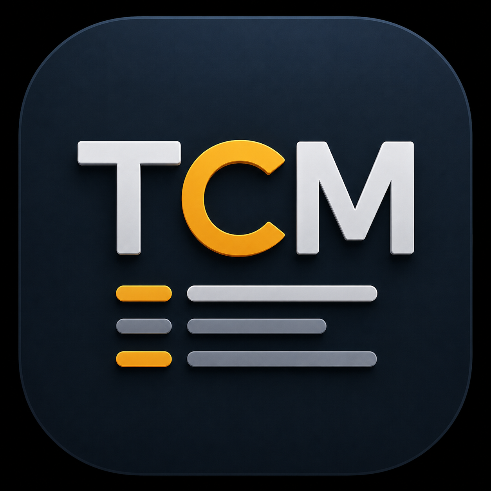
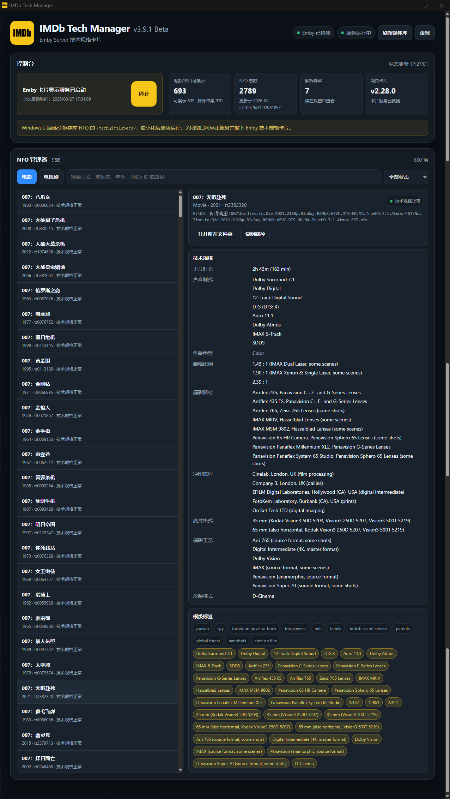
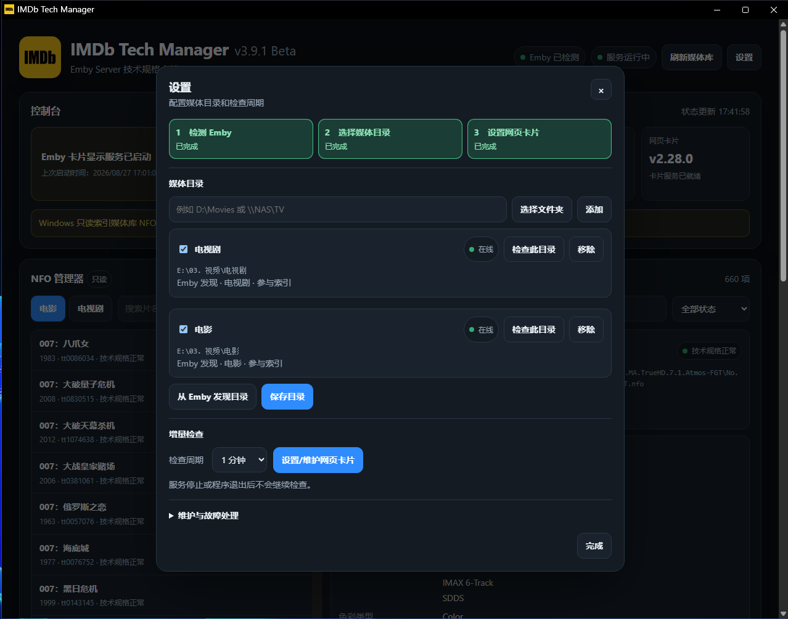
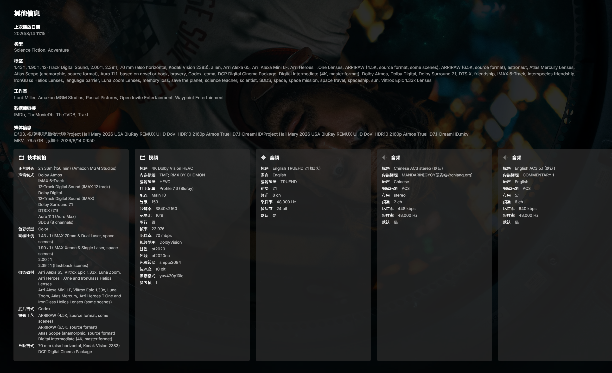

<div align="center">

# Tech Card Manager

[简体中文](../../README.md) | [繁體中文](./README.zh-Hant.md) | **English** | [Français](./README.fr.md) | [Русский](./README.ru.md) | [日本語](./README.ja.md) | [Español](./README.es.md) | [ไทย](./README.th.md)

<p align="center">

[](https://github.com/Eric-Hou1997/Tech-Card-Manager/releases)
[](https://github.com/Eric-Hou1997/Tech-Card-Manager/releases)
[](https://github.com/Eric-Hou1997/Tech-Card-Manager/stargazers)
[](https://github.com/Eric-Hou1997/Tech-Card-Manager/pulls)

</p>



**Technical specifications card management and Emby media library integration tool.**

Read-only NFO indexing and Technical Specifications card management for **Emby Server**.

</div>

---

v5.0.0 changes only the technology stack and platform integration, aiming to preserve v4.1.0 functionality, UI and operation. TCM still reads NFO files, manages Emby cards and updates manually, without AI. Real Emby, complete native UI/operation and Windows/Linux runtime acceptance remain incomplete; source checks and packages do not prove them. Existing screenshots are references for the original UI.

## 🎬 About

**Tech Card Manager (TCM)** brings **Technical Specifications** that already exist in media NFO files into the actual Emby browsing experience.

Most media libraries already do a good job of presenting:

* Title
* Cast
* Year
* Resolution
* Video codec
* Audio codec
* Stream information such as HDR / Dolby Vision

However, production-level information such as:

* Which cameras were used
* Which lenses were used
* Which film or digital capture formats were used
* Which cinematographic processes were involved
* Which sound formats were used
* Which aspect ratios were used
* How the work was mastered and presented

is usually not presented in a complete, structured way.

TCM scans user-configured movie and TV NFO files in **read-only mode**, builds its own derived index, and presents those technical specifications on media detail pages through the Emby Web Card.

The core goals of TCM are to:

* Bring existing Technical Specifications into the media-library browsing experience
* Keep original media NFO files strictly read-only
* Avoid taking ownership of the user's existing metadata workflow
* Manage and refresh Movie and TV libraries as separate spaces
* Safely maintain the Emby Technical Specifications Web Card
* Provide a Windows GUI, system-tray integration, and local service suitable for long-running use
* Keep important states, errors, and maintenance operations observable and verifiable
* Include Simplified Chinese, Traditional Chinese, and English (United States), with version-bound packs for French, Russian, Japanese, Spanish, and Thai

---

## ✨ Core Capabilities

### 📚 Read-only NFO Indexing

TCM can read user-configured Movie and TV library folders and extract Technical Specifications, together with other read-only information used for display and identification, from NFO files.

Media NFO files are **read-only data sources** for TCM.

TCM does not:

* Modify NFO files
* Automatically reorganize NFO files
* Automatically "repair" NFO files
* Write Technical Specifications
* Generate or delete tags
* Modify tag ownership
* Change the original contents of NFO files

Index data is maintained separately by TCM.

The original media metadata remains under the control of the user and the metadata tools already used in their workflow.

---

### 🖥️ Emby Technical Specifications Web Card

TCM converts indexed technical specifications into data suitable for media-library presentation and integrates them into Emby through a Web Card.

Current capabilities include:

* Technical Specifications card generation
* Technical Specifications card presentation
* Card asset serving
* Emby Web UI integration
* Web Card installation
* Web Card updates
* Web Card removal
* Web Card status detection
* Legacy component compatibility detection
* Required backup and recovery workflows

Web Card maintenance and media NFO data are two completely separate operation domains.

TCM may maintain Emby Web integration files, but **it does not modify media NFO files as part of that process**.

The Manager can switch instantly among Simplified Chinese, Traditional Chinese, and English (United States) without reloading or clearing current UI state. French, Russian, Japanese, Spanish, and Thai are separate assets on the `v5.0.0` GitHub Release and load only after download and verification. The Emby Web Card has an independent locale registry; uninstalled or unsupported Emby locales fall back to Simplified Chinese. Technical Specs keys such as `Camera` and `Sound mix`, and the underlying data structure, never change with the display language.

---

### 🎬 Separate Movie and TV Management

Movies and TV shows are separate media spaces in TCM.

They have:

* Independent library roots
* Independent indexes
* Independent search
* Independent filters
* Independent browsing
* Independent refresh scopes
* Independent status presentation

For example:

```text
Movies
  ↓
Refresh Current Library
  ↓
Scan Movie directories only
```

Refreshing Movies does not automatically scan TV directories.

Likewise, refreshing TV does not automatically rescan Movies.

---

### 🔎 Index Browsing and Inspection

The TCM Manager is not limited to starting the service. It can also be used to browse the media index that has already been built.

It can currently show:

* Indexed title count
* Total NFO count
* Cache / index status
* XML parsing errors
* Library accessibility status
* Movie and TV directories
* Technical Specifications
* Technical tags and other read-only information
* NFO paths
* Current tasks
* Error states

When an error occurs, TCM keeps as much useful diagnostic information as practical, such as the affected title, media type, NFO path, and task.

---

### 🪟 Residency and System Tray

The current official implementation targets:

**macOS ARM64 / Windows x64, ARM64 / Linux x64, ARM64**

When Tech Card Manager starts, the Manager and local service run together.

After the window is minimized, TCM can continue running in the system tray.

Current support includes:

* Single-instance execution
* Minimize to system tray
* Restore the Manager from the tray
* Start after login
* Silent minimize-to-tray when launched at login
* Service state management
* Explicit application exit
* Resource cleanup on exit

When TCM is fully exited, the local service stops as well.

---

## 🖼️ Interface Preview

### Manager UI

The Manager UI is used to inspect:

* Service status
* Index statistics
* Movie / TV spaces
* Media directories
* Technical Specifications
* Current task status
* Error information

<div align="center">



</div>

---

### Settings and Maintenance

The settings area is used to manage:

* Movie library roots
* TV library roots
* Startup behavior
* Start after login
* Silent startup
* Refresh interval
* Web Card maintenance
* Update checks
* Other application settings

<div align="center">



</div>

---

## 🎞️ Result Showcase

### Emby Movie Detail Page

Technical Specifications can appear as a dedicated card on Emby movie detail pages.

The card can present information such as:

* Cameras
* Lenses
* Film / Digital Capture
* Cinematographic Process
* Laboratory
* Aspect Ratio
* Sound Mix
* Printed Film Format
* Master / Presentation Format
* Other Technical Specifications

<div align="center">



</div>

---

### Emby TV Detail Page

TV uses an independent indexing and presentation flow.

Show-level Technical Specifications can be presented on the corresponding Emby media pages.

> 📷 **Result screenshot placeholder**
>
> Suggested file:
>
> `../images/emby-series-card.png`

<!--
<div align="center">


</div>
-->

---

### Technical Specifications Card Detail

This section can be used to show the complete visual result of the Technical Specifications Card, including items such as:

* Cameras
* Lenses
* Film formats
* Digital capture formats
* Cinematographic processes
* Sound formats
* Aspect ratios
* Master formats
* Presentation formats

> 📷 **Result screenshot placeholder**
>
> Suggested file:
>
> `../images/technical-specs-card-detail.png`

<!--
<div align="center">


</div>
-->

---

## 🔄 Core Workflow

```text
Media NFO
    ↓
Read-only scan and parsing
    ↓
TCM Derived Index
    ↓
Local Service / Card Assets
    ↓
Emby Web Card
    ↓
Technical Specifications in the Media Library
```

TCM does not write its index results back to media NFO files.

TCM can be understood as a read-only adapter positioned between:

```text
NFO Data Layer
    ↓
   TCM
    ↓
Emby Presentation Layer
```

It reads existing technical specifications, builds its own presentation index, and then delivers that information to the media-library interface.

---

## 🔗 Relationship with IMDb Tech Manager (ITM)

TCM and [**IMDb Tech Manager (ITM)**](https://github.com/Eric-Hou1997/IMDb-Tech-Manager) are two independent tools.

They work together around the same **Technical Specifications** workflow.

### 📦 IMDb Tech Manager (ITM)

ITM is primarily responsible for upstream data production and maintenance, including:

* IMDb Technical Specifications acquisition
* Technical Specifications structuring
* Technical Specifications normalization
* NFO management
* Writing Technical Specifications
* Technical tag generation
* AI-assisted semantic processing
* Manual correction
* Batch processing
* Metadata maintenance

---

### 🖥️ Tech Card Manager (TCM)

TCM is primarily responsible for downstream reading, indexing, presentation, and media-library integration:

* Reading existing NFO files in read-only mode
* Building a derived Technical Specifications index
* Managing the Emby Web Card
* Presenting technical specifications on media-library pages

Together, they can form a complete workflow:

```text
IMDb
  ↓
IMDb Tech Manager (ITM)
  ↓
NFO / Technical Specifications
  ↓
Tech Card Manager (TCM)
  ↓
Emby Technical Specifications Card
```

TCM **does not require ITM**.

Any other data source can be used as long as the NFO contains compatible Technical Specifications data that TCM can recognize.

---

## 🚫 Product Boundary

Tech Card Manager has a deliberately strict responsibility boundary.

TCM does **not**:

* Scrape IMDb
* Modify media NFO files
* Write Technical Specifications
* Generate Technical Tags
* Delete tags
* Modify user tags
* Run AI
* Manage prompts
* Track AI token usage
* Track AI API costs
* Take ownership of NFO metadata
* Migrate NFO ownership

Those responsibilities belong to data-management tools such as IMDb Tech Manager.

TCM focuses on one thing:

**Safely reading existing data and presenting it reliably.**

---

## 🔒 Data and Web Integration Safety

### NFO Files Remain Read-only

During:

* Scanning
* Indexing
* Refreshing
* Searching
* Presentation

TCM should leave media NFO contents unchanged.

An NFO file that cannot be parsed is recorded as an error rather than automatically repaired.

---

### Recoverable Web Card Maintenance

Installing, updating, or removing Emby Web files is completely separate from media NFO data.

These maintenance operations are designed to:

* Confirm the exact target
* Create a backup
* Verify that the backup is recoverable
* Build the complete modified result
* Preserve required BOM / newline behavior
* Verify the result after completion
* Roll back on failure

Operations that require administrator privileges are performed explicitly through Windows UAC.

---

### Careful Legacy Component Migration

TCM retains compatibility detection for selected legacy components, old Web Patches, and historical installation traces.

For operations with side effects such as:

* Removing old components
* Terminating processes
* Replacing Web Patches
* Cleaning historical files

the intended flow is:

```text
Identify Target
    ↓
Show Maintenance Plan
    ↓
User Confirmation
    ↓
Revalidate Target
    ↓
Execute
    ↓
Verify Result
```

If TCM cannot reliably determine ownership of a legacy component, it stops rather than risking an unsafe deletion.

---

## 🧩 Current Architecture

v5 uses Rust + Tauri 2 and TypeScript + Vue 3/Vite. Original v4 Windows source and release inputs remain in `windows/` and `packaging/`; v5 source is in `rewrite/`. The repository remains organized by product.

```text
Tauri 2 / Native Integration
          +
       Rust Core
          +
TypeScript / Vue 3 / Vite
          ↓
     Emby Web Card
```

---

## 💻 Current Runtime Environment

v5 packaging covers macOS ARM64, Windows x64/ARM64 and Linux x64/ARM64: five targets and nine packages, without macOS Intel. macOS requires 12.0 or newer. Windows uses WebView2; NSIS includes its offline installer. Linux uses WebKitGTK 4.1, GTK 3, tray libraries and pkexec when elevation is needed. No new PowerShell runtime dependency is introduced. Full real-platform and Emby acceptance remains pending, including permissions, tray lifecycle, login startup, client loading, card installation/removal/recovery and exit cleanup. macOS packages are ad hoc signed and not Apple notarized; Windows packages have no distribution certificate signature.

---

## 📦 Installation and Usage

### 1. Download

Download a package matching your OS and application architecture from [GitHub Releases](https://github.com/Eric-Hou1997/Tech-Card-Manager/releases). v5.0.0 filenames are listed below. Setup.exe is an installer; AppImage is an executable file.

| System | Architecture | Package |
| --- | --- | --- |
| macOS | ARM64 | `TCM-v5.0.0-MacOS-AArch64.dmg` |
| Windows | x64 | `TCM-v5.0.0-Windows-x64-Setup.exe` |
| Windows | ARM64 | `TCM-v5.0.0-Windows-AArch64-Setup.exe` |
| Linux | x64 | `TCM-v5.0.0-Linux-x64.AppImage` |
| Linux | x64 | `TCM-v5.0.0-Linux-x64.deb` |
| Linux | x64 | `TCM-v5.0.0-Linux-x64.rpm` |
| Linux | ARM64 | `TCM-v5.0.0-Linux-AArch64.AppImage` |
| Linux | ARM64 | `TCM-v5.0.0-Linux-AArch64.deb` |
| Linux | ARM64 | `TCM-v5.0.0-Linux-AArch64.rpm` |

---

### 2. Install the Application

macOS: open the DMG and move Tech Card Manager.app into Applications. Windows: run the NSIS Setup.exe for your architecture. Linux: install DEB/RPM through your distribution package manager, or grant the AppImage execute permission and run it. Fully exit through the menu bar or tray before upgrading. Application data is stored in the system user-data directory. Preserve the old Portable `data`, `logs`, `backup`, `runtime`, `updates` and all other original files; do not delete the old directory. Confirm legacy-data migration using the application checklist; NFO files are not rewritten.

---

### 3. Configure Media Libraries

After first launch, configure the relevant media-library roots in the Manager.

Movie and TV roots can be configured separately.

For example:

```text
Movies
  └── D:\Movies

TV
  └── D:\TV
```

TCM reads the corresponding NFO files from these directories.
TCM can also automatically discover library directories from Emby Server.

---

### 4. Build the Index

Refresh the library corresponding to the current Movie or TV space.

```text
NFO
 ↓
Parse
 ↓
Derived Index
```

The process does not write index data back to NFO files.

---

### 5. Configure the Emby Web Card

Follow the status and instructions shown in the Manager to install or maintain the Emby Web Card.

Emby Web file maintenance uses UAC on Windows, system administrator authorization on macOS and pkexec on Linux. Review the maintenance list before confirming. Refusing authorization does not rewrite media NFO files.

---

### 6. Keep TCM Running

TCM provides the local service used by the Web Card to access the index and related assets.

Therefore, TCM must remain running while the Technical Specifications Card is in use.

The Manager can be minimized to the tray and does not need to remain visible on the desktop.

---

## 🔄 Updating

Settings retain the original manual workflow: check updates, confirm the inline download prompt and open the system browser. The app selects DMG, NSIS, AppImage, DEB or RPM for the installed channel and does not install updates or replace itself automatically. Download the matching package → fully exit → install or replace → preserve user data and backups → restart → verify running state. Upgrade DEB/RPM through the system package manager. Release assets include `TCM-v5.0.0-SHA256SUMS.txt`; verify the downloaded file digest first.

---

## 🤖 Development with Coding Agents

The repository includes:

[**`AGENTS.md` →**](../../AGENTS.md)

It is one of the primary context entry points for Coding Agents such as Codex when working with Tech Card Manager.

It documents:

* Product identity
* Repository boundaries
* Responsibility separation between TCM and ITM
* Read-only NFO rules
* Technical Specifications indexing boundaries
* Web Card safety rules
* Legacy compatibility identifier rules
* Windows lifecycle rules
* UAC and administrator-maintenance constraints
* Testing requirements
* Release boundaries
* Changes that must not be made

Recommended development workflow:

```text
Fork / Clone
        ↓
Coding Agent reads AGENTS.md
        ↓
Read relevant source code and tests
        ↓
Confirm TCM product boundaries
        ↓
Analyze affected functional paths
        ↓
Create an implementation plan
        ↓
Modify code
        ↓
Run tests
        ↓
Validate on real Windows / Emby when required
        ↓
Submit Pull Request
```

The repository aims to provide:

```text
Source Code
  +
Architecture Knowledge
  +
Design Constraints
  +
Testing Methods
  +
Agent Context
```

This reduces the risk that developers or Coding Agents accidentally break existing product boundaries while modifying the project.

---

## 🚧 Current Status

Tech Card Manager is currently:

**Open Source · Under Active Development**

This repository has been maintained as an independent product starting with:

**v4.0.0**

The default development branch is:

```text
main
```

Currently available:

* Complete public source code
* Tauri 2 GUI (macOS ARM64 / Windows x64, ARM64 / Linux x64, ARM64)
* v5.0.0 Release
* SHA-256 checksum file
* Read-only NFO indexing
* Emby Technical Specifications Web Card
* Separate Movie / TV spaces
* Windows system tray integration
* Login startup
* Silent startup
* Update checks
* Base test suite
* Release build scripts
* `AGENTS.md`
* Apache License 2.0

---

## 🗺️ Roadmap

### Completed

* [x] Establish an independent Tech Card Manager Repository
* [x] Publicly maintain source code starting with `v4.0.0`
* [x] Windows x64 Portable GUI
* [x] Separate Movie / TV media spaces
* [x] Read-only NFO indexing
* [x] Derived Technical Specifications index
* [x] Emby Web Card integration
* [x] System tray integration
* [x] Single-instance lifecycle
* [x] Login startup
* [x] Silent tray startup
* [x] GitHub Release update checks
* [x] Establish base regression tests
* [x] Establish the Release build workflow
* [x] Publish the first public release, `v4.0.0`
* [x] Release the `v4.1.0` localization registry and version-bound language packs
* [x] Complete the built-in Simplified Chinese, Traditional Chinese, and English (United States) interfaces
* [x] Publish French, Russian, Japanese, Spanish, and Thai language packs
* [x] Freeze new-task log language while preserving historical logs, indexes, and NFO bytes
* [x] Distinguish proxy/network, GitHub throttling, missing-asset, and download failures
* [x] Complete content-measured responsive layouts for the header, dashboard, and NFO toolbar

### In Progress

The current v5 scope is limited to existing functionality and platform migration.

* [ ] Accept real Emby card installation, display, removal and failure recovery
* [ ] Compare native UI, dialogs, operation and pixels with the original
* [ ] Accept real-system operation and install/upgrade/uninstall on all five targets

Build success does not complete these pending checks. v5 does not authorize new features.

---

## 🐛 Issues

If you encounter a reproducible problem or have a well-defined feature request, please open an Issue:

[**GitHub Issues →**](https://github.com/Eric-Hou1997/Tech-Card-Manager/issues)

When possible, include:

* Tech Card Manager version
* Emby Server version
* Windows version
* Media type
* Reproduction steps
* Error information shown by the Manager
* NFO path, with private information removed as appropriate
* Whether UAC is involved
* Whether the Web Card is involved
* Whether legacy-component migration is involved

This information can help determine where the problem occurs in the chain:

```text
NFO
 ↓
Index
 ↓
Service
 ↓
Browser
 ↓
Emby DOM
 ↓
Card Render
```

---

## 🤝 Contributing

Tech Card Manager is open source.

Contributions are welcome, including:

* Forks
* Source-code review and research
* Bug fixes
* Feature improvements
* Test improvements
* UI / UX improvements
* Emby compatibility improvements
* Documentation improvements
* Pull Requests

Before modifying the code, please read:

[**`AGENTS.md` →**](../../AGENTS.md)

In particular, preserve the existing product boundaries when modifying:

* NFO scanning
* NFO parsing
* Technical Specifications indexing
* Emby Web Card
* Web file modification
* Web file recovery
* Legacy component compatibility
* Windows UAC
* System tray integration
* Application lifecycle
* Updates and Releases

**TCM's read-only media-NFO rule is a core design constraint.**

---

## 📄 License

Tech Card Manager is licensed under the:

**Apache License 2.0**

Full license:

[**LICENSE →**](../../LICENSE)

Additional project documents:

* [NOTICE](../../NOTICE)
* [PRIVACY.md](../legal/PRIVACY.en.md)
* [SECURITY.md](../../SECURITY.md)
* [TERMS.md](../legal/TERMS.en.md)

Author: **侯雁泽**

---

## ⚠️ Disclaimer

Tech Card Manager is an independently developed open-source project.

This project is **not officially affiliated with, authorized by, or endorsed by Emby, IMDb, or any other third-party platform**.

All third-party names, trademarks, data, and services remain the property of their respective owners.

TCM is not responsible for the source or licensing status of third-party Technical Specifications data.

Users are responsible for ensuring that their media metadata, third-party data, and use of related services comply with applicable terms of service, licensing requirements, and laws.

---

## 💡 Feedback & Suggestions

Tech Card Manager will continue to develop around:

* Read-only Technical Specifications indexing
* Emby Technical Specifications Card
* Media-library presentation
* Web UI integration
* Windows user experience
* Emby compatibility
* Stability
* Coding Agent development workflows

If you have ideas about card layout, media-type compatibility, Emby page integration, index browsing, Windows usage, or development workflows, you are welcome to participate through Issues.
