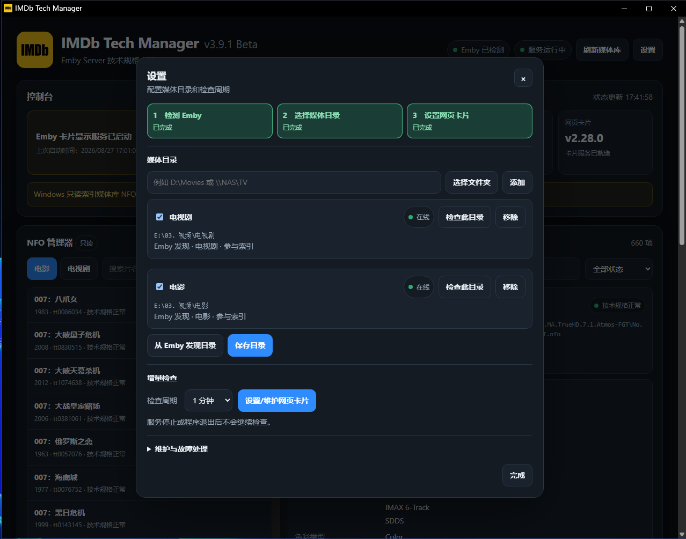

<div align="center">

# Tech Card Manager

[简体中文](../../README.md) | [繁體中文](./README.zh-Hant.md) | [English](./README.en.md) | **Français** | [Русский](./README.ru.md) | [日本語](./README.ja.md) | [Español](./README.es.md) | [ไทย](./README.th.md)

<p align="center">

[](https://github.com/Eric-Hou1997/Tech-Card-Manager/releases)
[](https://github.com/Eric-Hou1997/Tech-Card-Manager/releases)
[](https://github.com/Eric-Hou1997/Tech-Card-Manager/stargazers)
[](https://github.com/Eric-Hou1997/Tech-Card-Manager/pulls)

</p>


**Outil de gestion des cartes de caractéristiques techniques et d’intégration aux médiathèques Emby.**

Indexation NFO en lecture seule et gestion des cartes Technical Specifications pour **Emby Server**.

</div>

---

## 🎬 À propos

**Tech Card Manager (TCM)** intègre les **Technical Specifications** déjà présentes dans les fichiers NFO au véritable parcours de navigation d’Emby.

La plupart des médiathèques présentent déjà correctement :

* Le titre
* La distribution
* L’année
* La résolution
* Le codec vidéo
* Le codec audio
* Les informations de flux telles que HDR / Dolby Vision

Mais elles ne présentent généralement pas de façon complète et structurée les informations de production telles que :

* Les caméras utilisées
* Les objectifs utilisés
* Les formats de capture argentiques ou numériques utilisés
* Les procédés cinématographiques employés
* Les formats sonores utilisés
* Les rapports d’image utilisés
* La façon dont l’œuvre a été masterisée et présentée

TCM analyse en **lecture seule** les fichiers NFO des dossiers de films et séries configurés par l’utilisateur, construit son propre index dérivé, puis présente leurs caractéristiques techniques sur les pages de détail au moyen de la carte Web Emby.

Les objectifs essentiels de TCM sont :

* Intégrer les Technical Specifications existantes à la consultation de la médiathèque
* Maintenir les fichiers NFO multimédias strictement en lecture seule
* Ne pas s’approprier le flux de métadonnées existant de l’utilisateur
* Gérer et actualiser séparément les médiathèques Films et Séries
* Entretenir en toute sécurité la carte Web Emby Technical Specifications
* Fournir une interface Windows, une intégration à la zone de notification et un service local adaptés à un fonctionnement prolongé
* Rendre observables et vérifiables les états, erreurs et opérations de maintenance importants
* Inclure le chinois simplifié, le chinois traditionnel et l’anglais (États-Unis), avec des packs liés à la version pour le français, le russe, le japonais, l’espagnol et le thaï

---

## ✨ Fonctionnalités principales

### 📚 Indexation NFO en lecture seule

TCM peut lire les dossiers Films et Séries configurés par l’utilisateur et extraire des fichiers NFO les Technical Specifications ainsi que d’autres informations en lecture seule nécessaires à l’affichage et à l’identification.

Pour TCM, les fichiers NFO multimédias sont des **sources de données en lecture seule**.

TCM ne réalise aucune des opérations suivantes :

* Modifier les fichiers NFO
* Réorganiser automatiquement les fichiers NFO
* « Réparer » automatiquement les fichiers NFO
* Écrire des Technical Specifications
* Créer ou supprimer des tags
* Modifier la propriété des tags
* Changer le contenu d’origine des fichiers NFO

TCM conserve ses données d’index séparément.

Les métadonnées multimédias originales restent sous le contrôle de l’utilisateur et des outils déjà employés dans son flux de travail.

---

### 🖥️ Carte Web Emby Technical Specifications

TCM convertit les caractéristiques techniques indexées en données adaptées à la présentation dans la médiathèque et les intègre à Emby au moyen d’une carte Web.

Les fonctionnalités actuelles comprennent :

* Génération de la carte Technical Specifications
* Présentation de la carte Technical Specifications
* Publication des ressources de la carte
* Intégration à l’interface Web Emby
* Installation de la carte Web
* Mise à jour de la carte Web
* Suppression de la carte Web
* Détection de l’état de la carte Web
* Détection de compatibilité des anciens composants
* Procédures obligatoires de sauvegarde et de restauration

La maintenance de la carte Web et les données NFO multimédias relèvent de deux domaines opérationnels entièrement distincts.

TCM peut entretenir les fichiers d’intégration Web d’Emby, mais **ne modifie pas les fichiers NFO multimédias dans le cadre de cette opération**.

Le Gestionnaire peut passer instantanément du chinois simplifié au chinois traditionnel et à l’anglais (États-Unis), sans recharger ni effacer l’état actuel de l’interface. Le français, le russe, le japonais, l’espagnol et le thaï sont fournis séparément avec la Release GitHub `v4.1.0` et ne sont chargés qu’après téléchargement et vérification. La carte Web Emby dispose de son propre registre de langues ; une langue Emby non installée ou non prise en charge revient au chinois simplifié. Les clés Technical Specs telles que `Camera` et `Sound mix`, ainsi que la structure de données sous-jacente, ne changent jamais avec la langue d’affichage.

---

### 🎬 Gestion séparée des films et séries

Les films et les séries constituent deux espaces multimédias distincts dans TCM.

Ils disposent de :

* Racines de bibliothèque indépendantes
* Index indépendants
* Recherches indépendantes
* Filtres indépendants
* Navigation indépendante
* Périmètres d’actualisation indépendants
* Présentation d’état indépendante

Par exemple :

```text
Films
  ↓
Actualiser la médiathèque actuelle
  ↓
Analyser uniquement les dossiers de films
```

Actualiser les Films n’analyse pas automatiquement les dossiers de Séries.

De même, actualiser les Séries ne réanalyse pas automatiquement les Films.

---

### 🔎 Navigation et inspection de l’index

Le Gestionnaire TCM ne sert pas uniquement à démarrer le service. Il permet aussi de parcourir l’index multimédia déjà construit.

Il peut actuellement afficher :

* Le nombre de titres indexés
* Le nombre total de fichiers NFO
* L’état du cache / de l’index
* Les erreurs d’analyse XML
* L’état d’accessibilité de la médiathèque
* Les dossiers Films et Séries
* Les Technical Specifications
* Les tags techniques et autres informations en lecture seule
* Les chemins NFO
* Les tâches en cours
* Les états d’erreur

En cas d’erreur, TCM conserve autant d’informations de diagnostic utiles que possible, notamment le titre concerné, le type de média, le chemin NFO et la tâche.

---

### 🪟 Résidence Windows et zone de notification

L’implémentation officielle actuelle cible :

**Windows x64**

Au démarrage de Tech Card Manager, le Gestionnaire et le service local s’exécutent ensemble.

Après réduction de la fenêtre, TCM peut continuer de fonctionner dans la zone de notification.

Les fonctions actuelles comprennent :

* Exécution en instance unique
* Réduction dans la zone de notification
* Restauration du Gestionnaire depuis la zone de notification
* Démarrage après ouverture de session
* Réduction silencieuse dans la zone de notification lors d’un lancement à l’ouverture de session
* Gestion de l’état du service
* Fermeture explicite de l’application
* Libération des ressources à la fermeture

Lorsque TCM est complètement fermé, le service local s’arrête également.

---

## 🖼️ Aperçu de l’interface

### Interface du Gestionnaire

L’interface du Gestionnaire permet d’examiner :

* L’état du service
* Les statistiques de l’index
* Les espaces Films / Séries
* Les dossiers multimédias
* Les Technical Specifications
* L’état de la tâche actuelle
* Les informations d’erreur

<div align="center">


</div>

---

### Paramètres et maintenance

La zone des paramètres permet de gérer :

* Les racines de la médiathèque Films
* Les racines de la médiathèque Séries
* Le comportement au démarrage
* Le démarrage après ouverture de session
* Le démarrage silencieux
* L’intervalle d’actualisation
* La maintenance de la carte Web
* La recherche de mises à jour
* Les autres paramètres de l’application

<div align="center">



</div>

---

## 🎞️ Présentation du résultat

### Page de détail d’un film Emby

Les Technical Specifications peuvent apparaître dans une carte dédiée sur les pages de détail des films Emby.

La carte peut présenter notamment :

* Caméras
* Objectifs
* Capture film / numérique
* Procédé cinématographique
* Laboratoire
* Rapport d’image
* Mixage sonore
* Format de copie film
* Format de master / présentation
* Autres Technical Specifications

<div align="center">


</div>

---

### Page de détail d’une série Emby

Les séries utilisent un flux d’indexation et de présentation indépendant.

Les Technical Specifications au niveau de la série peuvent être présentées sur les pages Emby correspondantes.

> 📷 **Emplacement réservé à une capture du résultat**
>
> Nom de fichier suggéré :
>
> `../images/emby-series-card.png`

<!--
<div align="center">


</div>
-->

---

### Détail de la carte Technical Specifications

Cette section peut présenter le résultat visuel complet de la carte Technical Specifications, y compris des éléments tels que :

* Caméras
* Objectifs
* Formats de film
* Formats de capture numérique
* Procédés cinématographiques
* Formats sonores
* Rapports d’image
* Formats de master
* Formats de présentation

> 📷 **Emplacement réservé à une capture du résultat**
>
> Nom de fichier suggéré :
>
> `../images/technical-specs-card-detail.png`

<!--
<div align="center">


</div>
-->

---

## 🔄 Flux de travail principal

```text
NFO multimédia
    ↓
Analyse et lecture seules
    ↓
Index dérivé TCM
    ↓
Service local / Ressources de carte
    ↓
Carte Web Emby
    ↓
Technical Specifications dans la médiathèque
```

TCM ne réécrit pas les résultats de son index dans les fichiers NFO multimédias.

TCM peut être considéré comme un adaptateur en lecture seule placé entre :

```text
Couche de données NFO
    ↓
   TCM
    ↓
Couche de présentation Emby
```

Il lit les caractéristiques techniques existantes, construit son propre index de présentation, puis fournit ces informations à l’interface de la médiathèque.

---

## 🔗 Relation avec IMDb Tech Manager (ITM)

TCM et [**IMDb Tech Manager (ITM)**](https://github.com/Eric-Hou1997/IMDb-Tech-Manager) sont deux outils indépendants.

Ils collaborent autour du même flux de **Technical Specifications**.

### 📦 IMDb Tech Manager (ITM)

ITM est principalement responsable de la production et de la maintenance des données en amont, notamment :

* Acquisition des Technical Specifications IMDb
* Structuration des Technical Specifications
* Normalisation des Technical Specifications
* Gestion des NFO
* Écriture des Technical Specifications
* Génération de tags techniques
* Traitement sémantique assisté par IA
* Correction manuelle
* Traitement par lots
* Maintenance des métadonnées

---

### 🖥️ Tech Card Manager (TCM)

TCM est principalement responsable de la lecture, de l’indexation et de la présentation en aval, ainsi que de l’intégration à la médiathèque :

* Lecture des fichiers NFO existants en mode lecture seule
* Construction d’un index dérivé de Technical Specifications
* Gestion de la carte Web Emby
* Présentation des caractéristiques techniques sur les pages de la médiathèque

Ensemble, ils peuvent former un flux de travail complet :

```text
IMDb
  ↓
IMDb Tech Manager (ITM)
  ↓
NFO / Technical Specifications
  ↓
Tech Card Manager (TCM)
  ↓
Carte Emby Technical Specifications
```

TCM **ne nécessite pas ITM**.

Toute autre source de données peut être utilisée dès lors que le NFO contient des données Technical Specifications compatibles et reconnues par TCM.

---

## 🚫 Limites du produit

Tech Card Manager possède volontairement un périmètre de responsabilité strict.

TCM ne réalise **aucune** des opérations suivantes :

* Extraire des données d’IMDb
* Modifier les fichiers NFO multimédias
* Écrire des Technical Specifications
* Générer des tags techniques
* Supprimer des tags
* Modifier les tags de l’utilisateur
* Exécuter une IA
* Gérer des prompts
* Comptabiliser l’utilisation des tokens IA
* Comptabiliser les coûts d’API IA
* S’approprier les métadonnées NFO
* Migrer la propriété des NFO

Ces responsabilités appartiennent à des outils de gestion de données tels qu’IMDb Tech Manager.

TCM se concentre sur une seule chose :

**Lire en toute sécurité les données existantes et les présenter de manière fiable.**

---

## 🔒 Sécurité des données et de l’intégration Web

### Les fichiers NFO restent en lecture seule

Pendant :

* L’analyse
* L’indexation
* L’actualisation
* La recherche
* La présentation

TCM doit laisser le contenu des fichiers NFO multimédias inchangé.

Un fichier NFO impossible à analyser est enregistré comme erreur au lieu d’être réparé automatiquement.

---

### Maintenance récupérable de la carte Web

L’installation, la mise à jour ou la suppression des fichiers Web Emby est entièrement séparée des données NFO multimédias.

Ces opérations de maintenance sont conçues pour :

* Confirmer la cible exacte
* Créer une sauvegarde
* Vérifier que la sauvegarde est récupérable
* Construire le résultat modifié complet
* Préserver le comportement BOM / fins de ligne requis
* Vérifier le résultat après exécution
* Revenir en arrière en cas d’échec

Les opérations qui exigent des privilèges administrateur sont réalisées explicitement via l’UAC Windows.

---

### Migration prudente des anciens composants

TCM conserve une détection de compatibilité pour certains anciens composants, anciens Web Patches et traces d’installations historiques.

Pour les opérations ayant des effets de bord, comme :

* Supprimer d’anciens composants
* Arrêter des processus
* Remplacer des Web Patches
* Nettoyer des fichiers historiques

le flux prévu est :

```text
Identifier la cible
    ↓
Afficher le plan de maintenance
    ↓
Confirmation de l’utilisateur
    ↓
Revalider la cible
    ↓
Exécuter
    ↓
Vérifier le résultat
```

Si TCM ne peut pas déterminer de façon fiable le propriétaire d’un ancien composant, il s’arrête plutôt que de risquer une suppression dangereuse.

---

## 🧩 Architecture actuelle

L’implémentation Windows actuelle est principalement composée de :

```text
Interface Windows / Intégration native
          +
        Cœur Go
          +
      Web UI locale
          +
   Moteur PowerShell
          +
Zone de notification / Intégration navigateur
          ↓
     Carte Web Emby
```

Le dépôt est organisé par **produit**, et non de façon permanente par système d’exploitation.

Windows x64 est actuellement pris en charge, et des implémentations pour d’autres systèmes sont prévues.

---

## 💻 Environnement d’exécution actuel

La plateforme actuellement maintenue est :

**Windows x64**

Le produit et le flux de Release actuels ciblent notamment :

* Windows x64
* Windows PowerShell 5.1
* Windows UAC
* Zone de notification Windows
* Chargement par navigateur
* Interface Web Emby Server

Important :

**La réussite de la compilation du code source ne prouve pas le comportement sur la plateforme réelle.**

Les capacités suivantes doivent encore être validées dans de véritables environnements Windows / Emby :

* UAC
* Cycle de vie de la zone de notification
* Démarrage à l’ouverture de session
* Chargement dans le navigateur
* Comportement du DOM Emby
* Installation de la carte Web
* Suppression de la carte Web
* Récupération de la carte Web
* Libération des ressources après la fermeture de l’application

---

## 📦 Installation et utilisation

### 1. Télécharger

Accédez à :

[**GitHub Releases →**](https://github.com/Eric-Hou1997/Tech-Card-Manager/releases)

Le projet ne publie pas de fichier `.exe` nu et autonome dans les ressources d’une Release.

Le paquet officiel actuel est :

```text
TCM-v4.1.0-Windows-x64-EXE.zip
```

---

### 2. Extraire entièrement le ZIP

Commencez par extraire la totalité du ZIP dans un dossier fixe.

Exécutez ensuite :

```text
Tech-Card-Manager.exe
```

N’exécutez pas directement l’application depuis l’archive compressée.

---

### 3. Configurer les médiathèques

Après le premier lancement, configurez dans le Gestionnaire les racines de médiathèque concernées.

Les racines Films et Séries peuvent être configurées séparément.

Par exemple :

```text
Films
  └── D:\Movies

Séries
  └── D:\TV
```

TCM lit dans ces dossiers les fichiers NFO correspondants.
TCM peut également découvrir automatiquement les dossiers de médiathèque depuis Emby Server.

---

### 4. Construire l’index

Actualisez la médiathèque correspondant à l’espace Films ou Séries actuellement sélectionné.

```text
NFO
 ↓
Analyser
 ↓
Index dérivé
```

Le processus ne réécrit pas les données de l’index dans les fichiers NFO.

---

### 5. Configurer la carte Web Emby

Suivez l’état et les instructions affichés dans le Gestionnaire pour installer ou entretenir la carte Web Emby.

Windows peut demander les privilèges administrateur lorsqu’il faut modifier les fichiers Web Emby.

---

### 6. Laisser TCM en fonctionnement

TCM fournit le service local grâce auquel la carte Web accède à l’index et aux ressources associées.

TCM doit donc rester en fonctionnement pendant l’utilisation de la carte Technical Specifications.

Le Gestionnaire peut être réduit dans la zone de notification et n’a pas besoin de rester visible sur le bureau.

---

## 🔄 Mise à jour

TCM peut consulter les Releases GitHub officielles depuis la page des paramètres.

La version Portable actuelle **ne remplace pas automatiquement l’EXE en cours d’exécution**.

Flux de mise à jour recommandé :

```text
Rechercher une nouvelle version
    ↓
Ouvrir la Release GitHub
    ↓
Télécharger le nouveau ZIP
    ↓
Fermer complètement TCM depuis la zone de notification
    ↓
Extraire la nouvelle version
    ↓
Remplacer les fichiers du programme
    ↓
Conserver le dossier de données / la configuration existants
    ↓
Redémarrer
    ↓
Vérifier l’état d’exécution
```

La Release fournit également :

```text
TCM-v4.1.0-Windows-x64-EXE-SHA256SUMS.txt
```

pour vérifier l’intégrité du paquet.

---

## 🤖 Développement avec des Coding Agents

Le dépôt contient :

[**`AGENTS.md` →**](../../AGENTS.md)

Il constitue l’un des principaux points d’entrée contextuels pour les Coding Agents comme Codex lorsqu’ils travaillent sur Tech Card Manager.

Il documente :

* L’identité du produit
* Les limites du dépôt
* La séparation des responsabilités entre TCM et ITM
* Les règles NFO en lecture seule
* Les limites d’indexation des Technical Specifications
* Les règles de sécurité de la carte Web
* Les règles d’identification de compatibilité des anciens composants
* Les règles du cycle de vie Windows
* Les contraintes UAC et de maintenance administrateur
* Les exigences de test
* Les limites de Release
* Les changements à ne pas effectuer

Flux de développement recommandé :

```text
Fork / Clone
        ↓
Le Coding Agent lit AGENTS.md
        ↓
Lire le code source et les tests concernés
        ↓
Confirmer les limites du produit TCM
        ↓
Analyser les chemins fonctionnels concernés
        ↓
Créer un plan d’implémentation
        ↓
Modifier le code
        ↓
Exécuter les tests
        ↓
Valider sur un véritable environnement Windows / Emby si nécessaire
        ↓
Soumettre une Pull Request
```

Le dépôt vise à fournir :

```text
Code source
  +
Connaissance de l’architecture
  +
Contraintes de conception
  +
Méthodes de test
  +
Contexte Agent
```

Cela réduit le risque que des développeurs ou des Coding Agents enfreignent accidentellement les limites existantes du produit en le modifiant.

---

## 🚧 État actuel

Tech Card Manager est actuellement :

**Open Source · En développement actif**

Ce dépôt est maintenu comme produit indépendant depuis :

**v4.0.0**

La branche de développement par défaut est :

```text
main
```

Éléments actuellement disponibles :

* Code source public complet
* Interface Portable Windows x64
* Release v4.1.0
* Fichier de somme de contrôle SHA-256
* Indexation NFO en lecture seule
* Carte Web Emby Technical Specifications
* Espaces Films / Séries séparés
* Intégration à la zone de notification Windows
* Démarrage à l’ouverture de session
* Démarrage silencieux
* Recherche de mises à jour
* Suite de tests de base
* Scripts de construction de Release
* `AGENTS.md`
* Licence Apache 2.0

---

## 🗺️ Feuille de route

### Terminé

* [x] Créer un dépôt Tech Card Manager indépendant
* [x] Maintenir publiquement le code source à partir de `v4.0.0`
* [x] Interface Portable Windows x64
* [x] Espaces multimédias Films / Séries séparés
* [x] Indexation NFO en lecture seule
* [x] Index dérivé de Technical Specifications
* [x] Intégration de la carte Web Emby
* [x] Intégration à la zone de notification
* [x] Cycle de vie en instance unique
* [x] Démarrage à l’ouverture de session
* [x] Démarrage silencieux dans la zone de notification
* [x] Recherche de mises à jour des Releases GitHub
* [x] Créer les tests de régression de base
* [x] Créer le flux de construction de Release
* [x] Publier la première version publique `v4.0.0`
* [x] Publier le registre de localisation `v4.1.0` et les packs de langues liés à la version
* [x] Finaliser les interfaces intégrées en chinois simplifié, chinois traditionnel et anglais (États-Unis)
* [x] Publier les packs français, russe, japonais, espagnol et thaï
* [x] Figer la langue des journaux des nouvelles tâches tout en conservant les journaux historiques, les index et les octets NFO
* [x] Distinguer les erreurs de proxy/réseau, de limitation GitHub, de ressource absente et de téléchargement
* [x] Finaliser les mises en page responsives du bandeau, du tableau de bord et de la barre NFO selon le contenu réel

### En cours

* [ ] Améliorer la présentation de la carte Emby Technical Specifications
* [ ] Améliorer la compatibilité entre types de médias
* [ ] Améliorer la compatibilité entre différentes structures de pages Emby
* [ ] Améliorer la compatibilité entre versions de l’interface Web / du DOM Emby
* [ ] Améliorer la localisation des erreurs d’index
* [ ] Améliorer la récupération après erreur
* [ ] Améliorer la migration des anciens composants
* [ ] Améliorer le retour arrière des anciens composants
* [ ] Ajouter davantage de tests de régression réels sous Windows / Emby
* [ ] Améliorer la visualisation des états du Gestionnaire
* [ ] Améliorer l’expérience des paramètres
* [ ] Améliorer l’expérience de mise à jour Portable
* [ ] Continuer à améliorer `AGENTS.md`
* [ ] Continuer à améliorer le contexte Coding Agent
* [ ] Étudier la prise en charge d’autres systèmes d’exploitation tout en conservant la limite de produit en lecture seule de TCM

La feuille de route continuera d’évoluer selon le développement du projet et les retours d’utilisation réelle.

---

## 🐛 Issues

Si vous rencontrez un problème reproductible ou avez une demande de fonctionnalité bien définie, ouvrez une Issue :

[**GitHub Issues →**](https://github.com/Eric-Hou1997/Tech-Card-Manager/issues)

Si possible, indiquez :

* La version de Tech Card Manager
* La version d’Emby Server
* La version de Windows
* Le type de média
* Les étapes de reproduction
* Les informations d’erreur affichées par le Gestionnaire
* Le chemin NFO, après suppression des informations privées si nécessaire
* Si l’UAC intervient
* Si la carte Web intervient
* Si la migration d’anciens composants intervient

Ces informations permettent de déterminer où survient le problème dans la chaîne :

```text
NFO
 ↓
Index
 ↓
Service
 ↓
Navigateur
 ↓
DOM Emby
 ↓
Rendu de la carte
```

---

## 🤝 Contribution

Tech Card Manager est open source.

Les contributions sont bienvenues, notamment :

* Forks
* Revue et étude du code source
* Corrections de bogues
* Améliorations de fonctionnalités
* Améliorations des tests
* Améliorations UI / UX
* Améliorations de compatibilité Emby
* Améliorations de la documentation
* Pull Requests

Avant de modifier le code, lisez :

[**`AGENTS.md` →**](../../AGENTS.md)

En particulier, préservez les limites actuelles du produit lorsque vous modifiez :

* L’analyse NFO
* Le parsing NFO
* L’indexation des Technical Specifications
* La carte Web Emby
* La modification des fichiers Web
* La récupération des fichiers Web
* La compatibilité des anciens composants
* L’UAC Windows
* L’intégration à la zone de notification
* Le cycle de vie de l’application
* Les mises à jour et Releases

**La règle de lecture seule des NFO multimédias de TCM est une contrainte de conception essentielle.**

---

## 📄 Licence

Tech Card Manager est distribué sous :

**Licence Apache 2.0**

Licence complète :

[**LICENSE →**](../../LICENSE)

Documents supplémentaires du projet :

* [NOTICE](../../NOTICE)
* [PRIVACY.md](../legal/PRIVACY.fr.md)
* [SECURITY.md](../../SECURITY.md)
* [TERMS.md](../legal/TERMS.fr.md)

Auteur : **侯雁泽**

---

## ⚠️ Clause de non-responsabilité

Tech Card Manager est un projet open source développé de manière indépendante.

Ce projet **n’est ni officiellement affilié, ni autorisé, ni approuvé par Emby, IMDb ou toute autre plateforme tierce**.

Tous les noms, marques, données et services tiers demeurent la propriété de leurs détenteurs respectifs.

TCM n’est pas responsable de la source ni du statut de licence des données Technical Specifications de tiers.

Il appartient aux utilisateurs de veiller à ce que leurs métadonnées multimédias, les données tierces et leur utilisation des services associés respectent les conditions d’utilisation, les exigences de licence et les lois applicables.

---

## 💡 Retours et suggestions

Tech Card Manager continuera de se développer autour des thèmes suivants :

* Indexation Technical Specifications en lecture seule
* Carte Emby Technical Specifications
* Présentation dans la médiathèque
* Intégration Web UI
* Expérience utilisateur Windows
* Compatibilité Emby
* Stabilité
* Flux de développement avec Coding Agents

Si vous avez des idées sur la mise en page des cartes, la compatibilité des types de médias, l’intégration aux pages Emby, la navigation dans l’index, l’utilisation sous Windows ou les flux de développement, vous pouvez participer au moyen des Issues.
