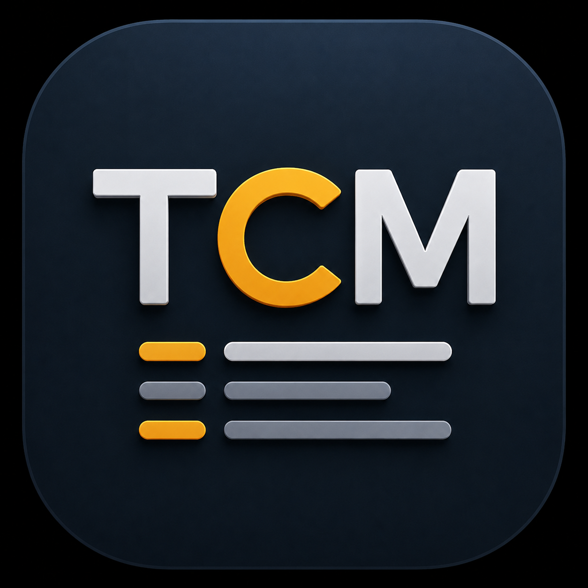
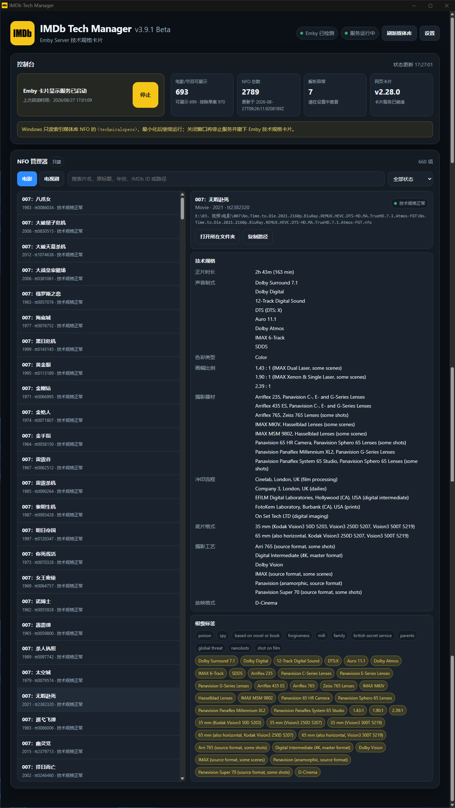
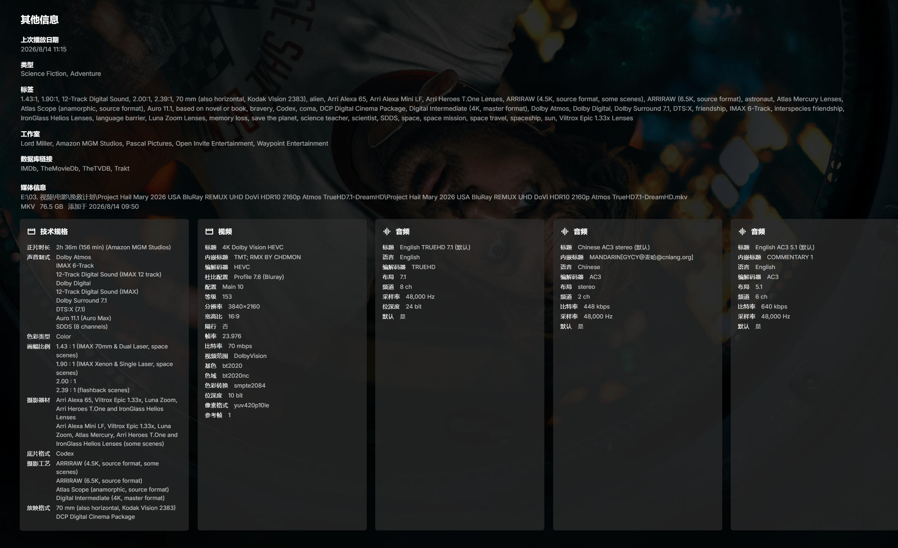

# Tech Card Manager

[简体中文](../../README.md) | [繁體中文](./README.zh-Hant.md) | [English](./README.en.md) | **Français** | [Русский](./README.ru.md) | [日本語](./README.ja.md) | [Español](./README.es.md) | [ไทย](./README.th.md)

Index NFO en lecture seule et gestion des cartes Technical Specifications pour Emby Server.

## Présentation

Tech Card Manager (TCM) analyse en lecture seule les NFO de films et de séries choisis par l’utilisateur, construit son propre index dérivé et affiche, via une Web Card Emby, les caméras, objectifs, formats de prise de vues, formats audio, rapports d’image et procédés de production.

TCM ne récupère pas les données IMDb, n’écrit pas dans les NFO et ne génère pas de tags. Pour créer ou maintenir ces données, utilisez l’application indépendante [IMDb Tech Manager (ITM)](https://github.com/Eric-Hou1997/IMDb-Tech-Manager).

## Version et plateforme

- Version stable : [`v4.1.0`](https://github.com/Eric-Hou1997/Tech-Card-Manager/releases/tag/v4.1.0)
- Plateforme : Windows x64 Portable
- Archive : `TCM-v4.1.0-Windows-x64-EXE.zip`
- Exécutable stable dans le ZIP : `Tech-Card-Manager.exe`
- La Release comprend SHA-256, instructions, changelog et packs de langue

## Fonctions principales

- Dossiers, index, recherche, filtres et actualisation séparés pour films et séries
- Inspecteur NFO en lecture seule et diagnostic des erreurs XML avec chemin complet
- Installation, mise à jour, retrait et contrôle d’état de la Web Card Emby
- Instance unique Windows, zone de notification, démarrage à la connexion et mode silencieux
- Mise en page adaptative du titre, du tableau de bord, des outils NFO et des deux volets
- Mise à jour distinguant proxy/réseau, limitations GitHub, ressource absente et échec de téléchargement

## Langues

Le chinois simplifié, le chinois traditionnel et l’anglais (États-Unis) sont intégrés à l’exécutable Portable. Le français, le russe, le japonais, l’espagnol et le thaï sont distribués sous forme de packs séparés dans la Release `v4.1.0` et ne sont chargés qu’après téléchargement et vérification.

La langue des nouveaux journaux est figée au démarrage de la tâche. Les anciens journaux, NFO, index, sauvegardes et données utilisateur ne sont pas réécrits. Une langue Emby non installée ou non prise en charge revient au chinois simplifié. Les clés telles que `Camera` et `Sound mix` ainsi que la structure JSON restent stables ; seul l’affichage est traduit.

## Limites de sécurité

- Les NFO restent toujours en lecture seule pour TCM ; leurs octets et horodatages ne changent pas pendant l’indexation.
- La maintenance Web Card ne touche que les fichiers Web Emby vérifiés et utilise sauvegarde externe, verrouillage, CAS, journal et remplacement atomique.
- Toute migration historique ou opération administrateur présente un plan et exige une confirmation explicite.
- Si le chemin, la propriété ou la sauvegarde ne peut pas être vérifié, l’opération s’arrête en sécurité.

## Aperçu

## Installation et mise à jour

Extrayez entièrement le ZIP, lancez `Tech-Card-Manager.exe`, configurez séparément les dossiers Films et Séries, créez l’index puis suivez l’interface pour la Web Card. TCM doit rester actif pendant l’utilisation de la carte et peut être réduit dans la zone de notification.

La version Portable ne remplace pas automatiquement l’EXE en cours. Quittez complètement depuis la zone de notification, extrayez la nouvelle version et remplacez l’exécutable en conservant `data`, `logs`, `backup`, `runtime` et `updates`.

## Feuille de route

Terminé : Windows x64 Portable, index NFO en lecture seule, espaces Films/Séries, maintenance sûre de la Web Card, cycle de vie de la zone de notification, registre multilingue et cinq packs, mise à jour compatible proxy et mise en page mesurée.

En cours : davantage de tests réels Windows/Emby/PowerShell 5.1/UAC, compatibilité avec les DOM Emby et les types de médias, récupération des composants historiques, mise à jour Portable et autres plateformes.

## Développement et licence

Lisez [`AGENTS.md`](../../AGENTS.md) avant de contribuer. L’architecture des packs est décrite dans [`docs/language-packs.md`](../language-packs.md).

Projet sous [Apache License 2.0](../../LICENSE). IMDb, Emby et les autres marques appartiennent à leurs propriétaires respectifs. Ce projet n’est ni affilié, ni autorisé, ni approuvé par IMDb.com, Inc. ou Emby LLC.
